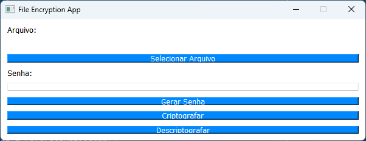

<div align="center">

# 📁 py-crypt-files

O projeto **py-crypt-files** é uma interface GUI para criptografia de arquivos. Ele foi desenvolvido em Python usando a biblioteca PyQt5 e a biblioteca de criptografia cryptography. 



</div>

## 📝 Descrição do Projeto

O **py-crypt-files** é um aplicativo que permite selecionar um arquivo local, fornecer uma senha ou gerar uma senha aleatória e realizar a criptografia ou descriptografia do arquivo selecionado. Ele oferece uma interface gráfica simples e intuitiva para facilitar o processo de criptografia e descriptografia de arquivos.

## ⚙️ Funcionalidades

- Selecionar um arquivo para criptografar ou descriptografar.
- Gerar uma senha aleatória ou inserir uma senha personalizada.
- Criptografar o conteúdo do arquivo usando uma chave simétrica.
- Criptografar a chave simétrica usando uma chave pública RSA.
- Salvar o arquivo criptografado com a extensão .cryptfile.
- Descriptografar arquivos criptografados com a extensão .cryptfile.

## 📋 Pré-requisitos

Antes de executar o projeto **py-crypt-files**, verifique se você possui os seguintes pré-requisitos instalados em seu ambiente:

- Python 3.x
- PyQt5
- cryptography

## 🚀 Instalação

1. Certifique-se de ter o Python 3.x instalado em seu sistema.
2. Instale as dependências necessárias executando o seguinte comando no terminal:


pip install PyQt5 cryptography


3. Baixe ou clone este repositório em seu ambiente local.

## 💻 Uso

1. Navegue até o diretório do projeto e execute o arquivo `main.py`:


python main.py


2. A interface gráfica do **py-crypt-files** será aberta.

3. Clique no botão "Selecionar Arquivo" para escolher o arquivo que você deseja criptografar ou descriptografar.

4. Insira uma senha no campo "Senha" ou clique em "Gerar Senha" para gerar uma senha aleatória.

5. Clique no botão "Criptografar" para criptografar o arquivo selecionado.

6. Clique no botão "Descriptografar" para descriptografar um arquivo criptografado.

## 🧩 Código-fonte

Aqui está o código-fonte do arquivo `main.py` que implementa o projeto **py-crypt-files**:

```python
import sys
import random
import string
import os
from PyQt5.QtWidgets import QApplication, QWidget, QLabel, QLineEdit, QPushButton, QVBoxLayout, QFileDialog, QMessageBox
from PyQt5.QtGui import QPalette, QColor, QFont
from PyQt5.QtCore import Qt
from cryptography.hazmat.primitives.asymmetric import rsa, padding
from cryptography.hazmat.primitives import serialization, hashes
from cryptography.hazmat.primitives.ciphers import Cipher, algorithms, modes

class FileEncryptionApp(QWidget):
    # Código omitido para maior clareza
    ...

if __name__ == "__main__":
    app = QApplication(sys.argv)
    # Código omitido para maior clareza
    ...


🤝 Contribuição
Contribuições para o projeto py-crypt-files são bem-vindas. Se você deseja contribuir, siga as etapas abaixo:

Faça um fork deste repositório.
Crie um novo branch para a sua feature (git checkout -b feature/nova-feature).
Faça as alterações necessárias no código.
Faça o commit das suas alterações (git commit -am 'Adicione uma nova feature').
Faça o push para o branch (git push origin feature/nova-feature).
Abra um pull request neste repositório.
📝 Licença
Este projeto está licenciado sob a MIT License.

